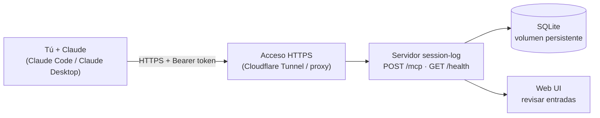

# session-log

Servidor MCP y skill para guardar **solo las sesiones de Claude que tú eliges** y recuperarlas después por fecha, proyecto o área, desde cualquier dispositivo, **sin que Claude invente nada**.

- Tú decides qué se guarda: nada se guarda automáticamente.
- Cada entrada queda en una base SQLite que tú controlas.
- Al consultar, Claude responde con lo que está guardado, no con lo que "recuerda".
- Solo usa la stdlib de Python 3.10+ (SQLite incluido), sin dependencias.

---

## Cómo funciona



- **Servidor MCP** (`scripts/mcp_server.py`): expone las herramientas por HTTP (remoto o local) o por stdio (local, sin red).
- **Skill** (`SKILL.md`): indica a Claude cuándo y cómo usarlas, por ejemplo preguntar el área si no está clara.

### Guardar (solo cuando tú lo pides)

1. Terminas una sesión que vale la pena conservar.
2. Le dices a Claude: *"guarda un resumen de esta sesión en session-log"*.
3. Claude pregunta el **área** (trabajo / personal) si no está clara.
4. Se escribe una fila en SQLite con fecha (America/Panama), proyecto, resumen, decisiones, pendientes y tags.

### Recuperar

1. Pides: *"¿qué hice en el proyecto X la semana pasada?"*.
2. Claude llama a `query_sessions` con los filtros.
3. El servidor devuelve las filas guardadas.
4. Claude te las presenta. Si no hay resultados, lo dice.

### Por qué Claude no inventa al recuperar

1. **Los datos vienen de filas guardadas**, no de la memoria del modelo.
2. **Instrucciones desde el servidor**: el MCP le indica que no invente, que diga cuando no hay resultados y que use fechas de Panamá. Aplican aunque el cliente no tenga la skill.
3. **Solo se guarda lo que tú pides**: sin ruido de sesiones irrelevantes.
4. **Es auditable**: puedes ver las entradas literales en la web UI o con `format: json`.
5. **Sin secretos**: las instrucciones piden no guardar tokens ni contraseñas.

> **Límite honesto:** el resumen lo escribe Claude **en el momento de guardar**, así que puede parafrasear u omitir algo. Lo que garantiza el sistema es que, al recuperar, Claude cuenta lo guardado y no fabrica sesiones que nunca existieron. Si el detalle importa, revisa la entrada literal.

---

## Uso

| Quiero... | Le digo a Claude |
|---|---|
| Guardar esta sesión | "Guarda un resumen de esta sesión en session-log" |
| Ver un día | "Muéstrame lo que guardé el 2026-10-07" |
| Ver un rango | "Resumen de session-log del 1 al 7 de octubre" |
| Filtrar por proyecto | "¿Qué guardé del proyecto raceflow?" |
| Filtrar por área | "Mis sesiones de trabajo de esta semana" |
| Resumen por proyecto | "Agrupa por proyecto lo de este mes" |
| Corregir áreas | "Lista las sesiones sin área y asígnalas" |

## Herramientas MCP

| Herramienta | Parámetros |
|---|---|
| `save_session` | `area` (obligatoria: `trabajo` o `personal`), `summary` (obligatorio), `project`, `decisions`, `pending`, `tags` |
| `query_sessions` | `date`, `from`/`to` o `last`; filtros combinables `project`, `tag` y `area` (`sin-area` = sesiones antiguas); `summary_by: "project"`; `format: "json"` |
| `list_sessions_without_area` | — |
| `set_area` | `area` más `ids` y/o `project`; solo cambia sesiones sin área, salvo con `force: true` |

Endpoints HTTP: `POST /mcp` (JSON-RPC, requiere `Authorization: Bearer`) y `GET /health` (sin autenticación).

---

## Instalación

### Formas de ejecutarlo

Elige **una** como fuente de verdad: cada modo usa su propia base.

| Modo | Dónde vive la base | Acceso desde | Token |
|---|---|---|---|
| [Servidor remoto](#servidor-remoto-coolify--cloudflare-tunnel) | volumen Docker en el servidor | cualquier dispositivo | obligatorio |
| [Servidor local por HTTP](#servidor-local-por-http) | tu máquina | esta máquina o tu red local | obligatorio fuera de localhost |
| [Local por stdio](#local-por-stdio-sin-red) | `~/.claude/session-log.db` en WSL | Claude Code y Desktop de esta PC | no aplica |

### Variables de entorno

Ver `.env.example`.

| Variable | Por defecto | Uso |
|---|---|---|
| `MCP_AUTH_TOKEN` | — | Token Bearer. Obligatorio si el servidor escucha fuera de localhost |
| `SESSION_LOG_DB` | `~/.claude/session-log.db` (Docker: `/data/session-log.db`) | Ruta de la base |
| `SESSION_LOG_TZ` | `America/Panama` | Zona horaria de las fechas de consulta |
| `MCP_HOST` / `MCP_PORT` | `127.0.0.1` / `8000` (Docker: `0.0.0.0`) | Dirección HTTP |
| `MCP_ALLOWED_ORIGINS` | vacío | Orígenes de navegador permitidos; otros `Origin` se rechazan |

Genera el token con:

```bash
python3 -c "import secrets; print(secrets.token_urlsafe(32))"
```

### Servidor remoto (Coolify + Cloudflare Tunnel)

Despliega en tu propio dominio (`https://TU-DOMINIO/mcp`). La base SQLite no se expone: vive en el volumen del contenedor.

1. En Coolify, crea un recurso desde el repositorio con el build pack **Docker Compose** (`docker-compose.yml`).
2. Define `MCP_AUTH_TOKEN` en las variables de entorno del recurso (no uses `.env` en el servidor).
3. Asigna el dominio `https://TU-DOMINIO` al servicio `session-log`, puerto `8000`.
4. En Cloudflare Zero Trust, agrega al túnel el hostname `TU-DOMINIO`, apuntando al proxy de Coolify o al contenedor en el puerto `8000`.
5. Verifica:
   ```bash
   curl https://TU-DOMINIO/health
   ```

Los datos quedan en el volumen `session-log-data` (`/data/session-log.db`), que sobrevive a redeploys.

<details>
<summary><strong>Migrar la base actual al servidor</strong></summary>

Hazlo justo después del primer despliegue, antes de guardar sesiones nuevas. En WSL, crea una copia consistente:

```bash
python3 -c "import sqlite3,os; sqlite3.connect(os.path.expanduser('~/.claude/session-log.db')).backup(sqlite3.connect('/tmp/session-log.db'))"
```

Cópiala al servidor (`scp`) y cárgala en el volumen:

```bash
docker exec -i $(docker ps -qf name=session-log) sh -c 'cat > /data/session-log.db' < session-log.db
```

La columna `area` se agrega sola al primer uso. Las sesiones antiguas quedan sin área; asígnala con `list_sessions_without_area` y `set_area`.

</details>

<details>
<summary><strong>Respaldos</strong></summary>

```bash
docker exec $(docker ps -qf name=session-log) python3 -c "import sqlite3; sqlite3.connect('/data/session-log.db').backup(sqlite3.connect('/data/backup.db'))"
docker cp $(docker ps -qf name=session-log):/data/backup.db ./session-log-$(date +%F).db
```

</details>

### Servidor local por HTTP

Con Docker:

```bash
MCP_AUTH_TOKEN=<token> docker compose -f docker-compose.yml -f docker-compose.local.yml up -d --build
```

O con Python:

```bash
MCP_AUTH_TOKEN=<token> python3 scripts/mcp_server.py --http
```

Queda en `http://127.0.0.1:8000/mcp`; también funciona desde Claude Desktop en Windows, porque WSL2 reenvía `localhost`. Para usarlo desde otros equipos publica en `0.0.0.0` (en `docker-compose.local.yml`, o con `--host 0.0.0.0`). Por HTTP plano el token viaja sin cifrar: úsalo solo en una red de confianza o detrás de un proxy con TLS.

### Local por stdio (sin red)

El cliente lanza el servidor como proceso, sin puerto ni token. Usa la base de WSL.

- **Claude Code (WSL):**
  ```bash
  claude mcp add --scope user session-log -- python3 /home/dev/session-log/scripts/mcp_server.py
  ```
- **Claude Desktop (Windows)**, en `%APPDATA%\Claude\claude_desktop_config.json`:
  ```json
  {
    "mcpServers": {
      "session-log": {
        "command": "wsl.exe",
        "args": ["python3", "/home/dev/session-log/scripts/mcp_server.py"]
      }
    }
  }
  ```
  Con varias distribuciones WSL, agrega `"-d", "<distro>"` al inicio de `args`.

La base debe estar en el filesystem de WSL: SQLite falla sobre carpetas de Windows montadas (`disk I/O error`).

### Conectar los clientes por HTTP

Usa `https://TU-DOMINIO/mcp` (remoto) o `http://127.0.0.1:8000/mcp` (local).

- **Claude Code:**
  ```bash
  claude mcp add --transport http --scope user session-log \
    https://TU-DOMINIO/mcp \
    --header "Authorization: Bearer <token>"
  ```
  Incluye el prefijo `Bearer `. Verifica con `claude mcp list`; evita `claude mcp get`, porque imprime el token.

- **Claude Desktop:** su configuración solo lanza procesos, así que se usa el puente [`mcp-remote`](https://www.npmjs.com/package/mcp-remote) (requiere Node.js en Windows). Reinicia Claude Desktop después de guardar.
  ```json
  {
    "mcpServers": {
      "session-log": {
        "command": "cmd",
        "args": [
          "/c", "npx", "-y", "mcp-remote",
          "https://TU-DOMINIO/mcp",
          "--header", "Authorization:${AUTH_HEADER}"
        ],
        "env": { "AUTH_HEADER": "Bearer <token>" }
      }
    }
  }
  ```

> claude.ai web y móvil (conectores personalizados) no son compatibles por ahora: requieren OAuth, que esta versión no implementa.

### Skill

```bash
ln -s ~/session-log ~/.claude/skills/session-log
```

En Claude Desktop o claude.ai también puedes subir solo `SKILL.md`.

---

## Seguridad

- Rota el token si alguna vez se expuso (pegado en chat, captura, logs).
- No guardes secretos en los resúmenes.
- Respalda el volumen de datos periódicamente.
- No muestres tu token real al grabar demos: usa `<token>`.

---

## Desarrollo

### Pruebas

Usan una base temporal; nunca tocan la real.

```bash
python3 -m unittest discover -s tests -v
```

### Estructura

| Archivo | Rol |
|---|---|
| `scripts/common.py` | conexión, esquema, migración y zona horaria |
| `scripts/sessions.py` | lógica: guardar, consultar, formatear y asignar área |
| `scripts/mcp_server.py` | servidor MCP (stdio y HTTP) |
| `tests/test_mcp.py` | pruebas con base temporal |
| `Dockerfile`, `docker-compose.yml` | despliegue en servidor |
| `docker-compose.local.yml` | puerto publicado para servidor local |

### Modelo de datos (tabla `sessions`)

| Campo | Tipo | Nota |
|---|---|---|
| id | INTEGER | autoincremental |
| created_at | TEXT | UTC, ISO 8601, indexado |
| area | TEXT | `trabajo` o `personal` (CHECK), indexado; NULL solo en filas antiguas |
| project | TEXT | indexado |
| summary | TEXT | |
| decisions / pending / tags | TEXT | arreglos JSON |

Las consultas convierten las fechas de America/Panama (UTC-5) a UTC. Al abrir una base existente, la columna `area` se agrega sola sin tocar los datos.