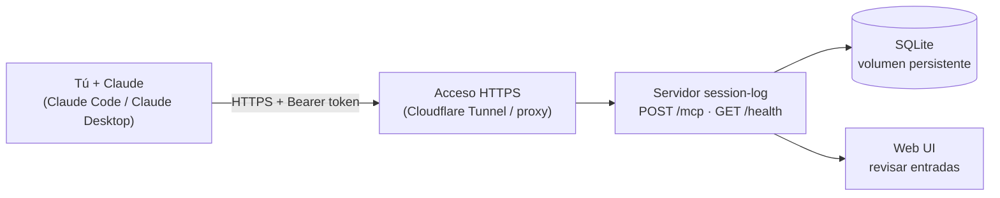

# session-log

Servidor MCP para guardar **solo las sesiones de Claude que tú eliges** y recuperarlas después por fecha, proyecto o área, desde cualquier dispositivo, **sin que Claude invente nada**.

- Tú decides qué se guarda (nada se guarda automáticamente).
- Cada entrada queda en una base SQLite que tú controlas.
- Al consultar, Claude responde con lo que está guardado, no con lo que "recuerda".

---

## Cómo funciona



El servidor expone 4 herramientas MCP:

| Herramienta | Qué hace |
|---|---|
| `save_session` | Guarda un resumen (proyecto, área, resumen, decisiones, pendientes, tags). |
| `query_sessions` | Consulta por fecha, rango (`from`/`to`), `last`, proyecto, tag o área. Soporta `summary_by='project'` y `format` text/json. |
| `list_sessions_without_area` | Lista entradas sin área asignada. |
| `set_area` | Asigna el área (`trabajo` o `personal`) a una entrada. |

### Dos caminos

**Guardar (solo cuando tú lo pides)**

1. Terminas una sesión que vale la pena conservar.
2. Le dices a Claude: *"guarda un resumen de esta sesión en session-log"*.
3. Claude pregunta el **área** (trabajo / personal) si no está clara.
4. Se escribe una fila en SQLite con fecha (zona America/Panama), proyecto, resumen, decisiones, pendientes y tags.

**Recuperar**

1. Pides: *"¿qué hice en el proyecto X la semana pasada?"*.
2. Claude llama a `query_sessions` con los filtros.
3. El servidor devuelve las filas guardadas.
4. Claude te las presenta. Si no hay resultados, lo dice.

---

## Por qué Claude no inventa al recuperar

1. **Los datos vienen de filas guardadas**, no de la memoria del modelo: la respuesta sale de una consulta a la base.
2. **Instrucciones desde el servidor**: el MCP le indica a Claude que no invente, que diga cuando no hay resultados y que use fechas de Panamá.
3. **Solo se guarda lo que tú pides**: no hay ruido de sesiones irrelevantes.
4. **Es auditable**: puedes ver las entradas literales en la web UI o con `format: json` y compararlas con lo que Claude dijo.
5. **Sin secretos**: las instrucciones piden no guardar tokens ni contraseñas.

> **Límite honesto:** el resumen lo escribe Claude **en el momento de guardar**, así que puede parafrasear o omitir algo. Lo que garantiza el sistema es que, al recuperar, Claude cuenta lo guardado y no fabrica sesiones que nunca existieron. Si el detalle importa, revisa la entrada literal.

---

## Instalación

### Servidor (Docker / Coolify)

```bash
git clone https://github.com/mrdavis-dev/sessionlog.git
cd sessionlog
cp .env.example .env     # define MCP_AUTH_TOKEN con un valor largo y aleatorio
docker compose up -d
curl http://localhost:8000/health
```

- Usa un **volumen con nombre** para los datos (`session-log-data`) y haz respaldo periódico.
- Para acceso remoto, publícalo detrás de HTTPS (por ejemplo Cloudflare Tunnel). El token Bearer protege el endpoint.

### Claude Code

```bash
claude mcp add --transport http --scope user session-log \
  https://TU-DOMINIO/mcp \
  --header "Authorization: Bearer TU_TOKEN"
```

Debe incluir el prefijo `Bearer `. Verifica con `claude mcp list`. Evita `claude mcp get`, porque imprime el token.

### Claude Desktop

Claude Desktop usa su propio archivo de configuración (`claude_desktop_config.json`), distinto al de Claude Code. Requiere **Node.js instalado en Windows** (`node -v` en PowerShell) porque usa `npx`.

#### Opción A (la más sencilla): pídeselo a Claude

Abre Claude Code en tu proyecto y pega este prompt, cambiando el dominio:

```text
Configura el MCP session-log en Claude Desktop (Windows).
- URL: https://TU-DOMINIO/mcp
- Usa mcp-remote con `cmd /c npx -y mcp-remote`.
- El token va en env.AUTH_HEADER con el formato "Bearer <token>" y la cabecera
  se pasa como --header "Authorization:${AUTH_HEADER}".
- Ubica claude_desktop_config.json (normalmente %APPDATA%\Claude\; si no existe,
  revisa %LOCALAPPDATA%\Packages\Claude_*\LocalCache\Roaming\Claude\), haz una
  copia .bak, y agrega solo el bloque "session-log" dentro de mcpServers sin
  tocar lo demás. Guarda el JSON en UTF-8 sin BOM.
- No imprimas el token en pantalla ni lo escribas en ningún otro archivo.
```

Claude encuentra el archivo, respalda el original y mezcla el bloque. Después **reinicia Claude Desktop por completo** (también desde la bandeja del sistema).

> **Sobre el token:** si lo pegas en el chat, queda en el historial de la conversación. Lo más seguro es que Claude lo lea de una variable de entorno, o que lo escribas tú directamente en el archivo. Si lo expusiste, rótalo.

#### Opción B: manual

1. Abre Claude Desktop → **Settings → Developer → Edit Config**. Esto crea el archivo si no existe y abre su carpeta.
2. Si lo buscas a mano: `%APPDATA%\Claude\claude_desktop_config.json`. Si la carpeta no existe y Claude se instaló desde la Microsoft Store, está en `%LOCALAPPDATA%\Packages\Claude_*\LocalCache\Roaming\Claude\`.
3. Agrega el bloque (si el archivo ya tiene contenido, añade solo `"session-log"` dentro de `mcpServers`):

```json
{
  "mcpServers": {
    "session-log": {
      "command": "cmd",
      "args": [
        "/c", "npx", "-y", "mcp-remote",
        "https://TU-DOMINIO/mcp",
        "--header", "Authorization:${AUTH_HEADER}"
      ],
      "env": { "AUTH_HEADER": "Bearer TU_TOKEN" }
    }
  }
}
```

4. Guarda y reinicia Claude Desktop por completo. `session-log` debe aparecer entre las herramientas de la conversación.

> claude.ai web y móvil no son compatibles por ahora (requieren OAuth).

---

## Uso

| Quiero... | Le digo a Claude |
|---|---|
| Guardar esta sesión | "Guarda un resumen de esta sesión en session-log" |
| Ver un día | "Muéstrame lo que guardé el 2026-10-07" |
| Ver un rango | "Resumen de session-log del 1 al 7 de octubre" |
| Filtrar por proyecto | "¿Qué guardé del proyecto raceflow?" |
| Filtrar por área | "Mis sesiones de trabajo de esta semana" |
| Resumen por proyecto | "Agrupa por proyecto lo de este mes" |
| Corregir áreas | "Lista las sesiones sin área y asígnalas" |

---

## Seguridad

- Rota el token si alguna vez se expuso (pegado en chat, captura, logs).
- No guardes secretos en los resúmenes.
- Mantén respaldo del volumen de datos.
- No muestres tu token real al grabar demos: usa `TU_TOKEN`.
